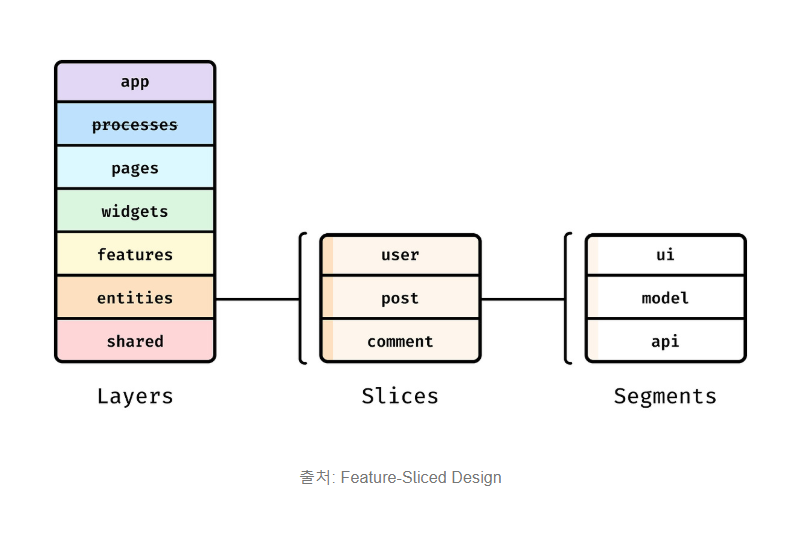
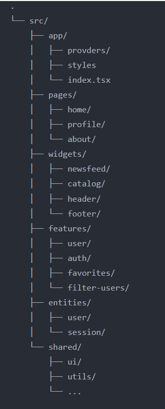

<strong>FSD(Feature-Sliced Design)</strong>는 아키텍처 패턴 중 하나로, 기능(Feature)에 따라 프로젝트 구조를 계층화한다.
크게 <strong>Layer, Slice, Segment</strong> 라는 개념으로 구분하여 그 하위에 세부 개념이 추가된다.
이 중 <strong>Layer</strong>는 계층 수준의 개념을 가지며, 각 레이어는 하위 레이어만 참조할 수 있다.

ex) app에서 pages, widgets 등을 참조할 수 있고 pages에서 그 아래 레이어를 참조할 수 있는 단방향 참조 구조

### Layers

각 레이어의 역할

- App: 애플리케이션 로직이 초기화되는 곳, 애플리케이션의 진입점 역할을 수행하는 레이어, <strong>루트 설정 및 글로벌 상태 관리, 라우팅, 프로바이더</strong> 등이 이에 해당함
- Pages: <strong>애플리케이션의 페이지</strong>를 포함하는 레이어
- Widgets: <strong>페이지 상에서 사용되는 독립적인 UI 컴포넌트</strong>들이 존재하는 레이어
- Features: <strong>유저 시나리오와 기능</strong>을 다루는 레이어(ex) 좋아요나 리뷰 작성, 제품 평가 등 선택적으로 사용되는 레이어
- Entities: <strong>비즈니스 엔티티</strong>를 포함하는 레이어(ex) 유저, 리뷰, 댓글과 같은 <strong>도메인에 대한 내용</strong>이며 선택적으로 사용됨
- Shared: <strong>특정 비즈니스 로직에 종속되지 않은 재사용가능한 컴포넌트와 유틸리티</strong>가 포함된 레이어

### Slices

Slice는 각 레이어 하위에서 구분되는 수준을 의미하며, 어떤 애플리케이션을 구현하느냐에 따라 디렉토리 구성이 달라질 수 있다. 주로 <strong>코드를 목적에 맞게 그룹화하는 것</strong>을 목표로 한다.
ex)

### Segments

각 슬라이스는 <strong>Segment</strong>로 구성되며 목적에 따라 코드를 나누는데 사용된다.

- api: 서버 요청과 관련된 파일
- ui: 슬라이스의 UI 컴포넌트 파일
- model: 비즈니스 로직 및 상태의 인터랙션 파일
- lib: 슬라이스 내에서 사용되는 보조 기능 파일
- config: 슬라이스에서 필요한 설정 파일
- consts: 슬라이스 내에서 필요한 상수 파일

### Public API

각 슬라이스와 세그먼트는 Public API를 가지는데 이는 index.tsx와 같은 파일을 의미하며 이 파일을 통해 필요한 기능만 외부로 노출할 수 있다.

- 애플리케이션 슬라이스와 세그먼트는 index.tsx에 정의된 기능과 컴포넌트만 사용한다.
- Public API에 정의되지 않은 슬라이스 또는 세그먼트의 내부 영역은 격리되어야 한다.

\* 고전적인 아키텍처는 모듈 형식으로 구성된 아키텍처를 의미하며, 이는 특정 기능을 어떤 모듈이나 컴포넌트에 넣을지 명확하지 않을 때가 있다.
예를 들어, 좋아요 기능을 활용하는 검색과 마이페이지 페이지가 있다는 가정이 있으면 좋아요 기능을 어떻게 관리해야 되는지에 대한 문제가 발생하게 되는데 이를 FSD는 명확하게 구분하여 관리할 수 있도록 만들어 준다는 것이 목적이다.
