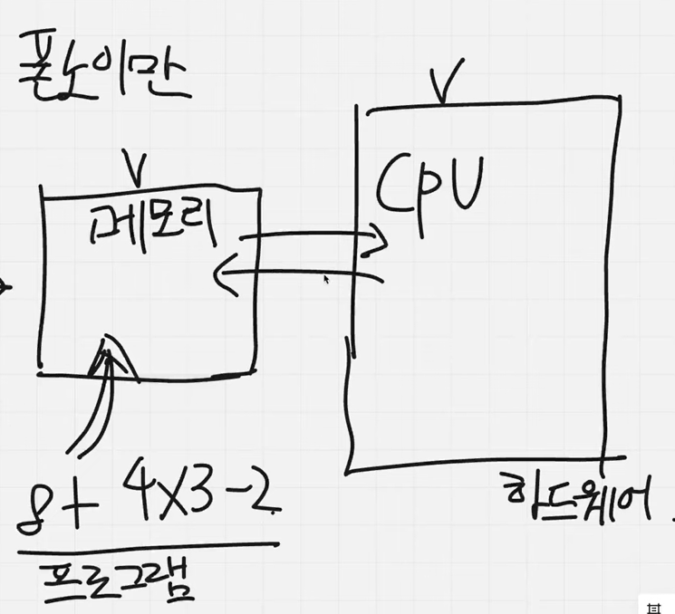

## Cache란 무엇인가?

### 초기 컴퓨터 구조

예를 들어 6x8같은 특정 프로그램을 수행할 수 있는 톱니구조(하드웨어)로 되어있는 컴퓨터 
한계점 -> 소프트웨어와 하드웨어가 완전 결합이 되어 있어 특정 프로그램만 수행할 수 있고 다른 프로그램을 수행하기 위해선 톱니 자체의 구조를 바꿔야 되는 불편함이 있었음

폰 노이만이 한계점을 없애기 위해 메모리와 CPU(처리장치)를 분리함 

=> 메모리(소프트웨어)와 CPU(하드웨어)를 분리함으로써 완전결합의 한계를 해결

한계점 -> CPU의 처리속도가 빨라지는 데 비해 메모리 처리 속도가 따라가지 못함으로써 병목현상이 생김 
메모리 처리 속도가 느려지는 이유 -> 메모리가 점점 커짐에 따라서 찾는 속도가 느려지기 때문에

\*이러한 한계점을 해결하기 위해 CPU에 Cache 등장 
=> 메모리에 비해 좀 더 작은 저장공간이지만 CPU 안에 있어서 데이터를 메모리에 저장하지 않고 CPU에 있는 Cache에 저장함으로써 데이터 처리 속도가 훨씬 빨라짐 (처리속도를 빨라지게 하는게 목적)

### Cache 정의

처리결과를 임시로 저장하는 행위이지 저장소

### Next.js Caching

\*Persistant vs In-memory 
I/O가 In-memory가 훨씬 빈번하게 이루어지고 계산 복잡도(로직의 크기)가 훨씬 덜하다.

- Router Cache(In-memory)
  Client 쪽에서 이뤄지다 보니 I/O가 빈번하게 일어남, 계산이 상대적으로 복잡하지 않음
- Full Route Cache(persistant)
  build time에 Set되는 cache -> 계산이 복잡해서 I/O가 빈번하지 않음
- Data Cache(persistant)
- Request Memoization(In-memory)
  Data fetching을 하기 때문에 빠르게 처리해야 되기 때문에 In-memory
