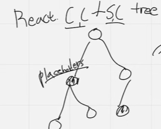

- 컴포넌트
  데이터(props, state)를 인자로 받아서 JSX를 return하는 함수

### 컴포넌트 렌더링

\*컴포넌트가 호출 시 JSX를 리턴하고 jsx가 바벨을 통해서 React.Element로 변하기 때문에 컴포넌트가 리턴하는 것은 결국 React.Element인 것을 알 수 있고 이 것은 객체이며 결국 fiver로 확장되서 V-dom을 이룬다.
이 DOM이 실제 DOM에 반영되는 것

JSX가 바벨을 만나면 트랜스파일링이 됨 -> React Element로 변환 
\*React Element는 DOM에 관련된 DOM에 표현할 필요한 정보들을 담고 있는 객체

### 서버 컴포넌트 렌더링

Dan abramov(리덕스 만든 사람) - 기존에 컴포넌트는 하나 밖에 없었는데 이 컴포넌트를 확장해서 서버 컴포넌트를 만들게 됨

### 서버 컴포넌트 렌더링 과정

#### 서버 렌더링

1. <strong>React 서버 컴포넌트에서 RSC 페이로드를 만들어줌</strong> 
   RSC Payload - 컴팩트 바이너리 리플리제이션

- SC(Server Component) result
- 클라이언트 컴포넌트의 렌더 위치, 클라이언트 컴포넌트의 자바스크립트 파일 위치
- props(서버 컴포넌트 => 클라이언트 컴포넌트)

2. <strong>Next JS가 RSC payload를 활용 + 클라이언트 컴포넌트 Javascript Instructions를 활용해서 html 렌더</strong>

#### 클라이언트 렌더링

1. 서버에서 렌더링한 HTML을 받아 즉시 보여줌(preview of the Routes)
2. RSC 페이로드를 받아와서 reconcile(리액트 트리를 구성 => 가상 DOM 작업 후 실제 DOM에 update)
   =>클라이언트 컴포넌트와 서버 컴포넌트를 reconcile해 placeholder를 채움

   

3. hydrate(수화) - 인터렉션 가능하게 하는 작업(JavaScript, Instructions)

ex)
hydrate 되기 전 서버에서 렌더된 html

### 클라이언트 컴포넌트 렌더링

Full page load 과정일 때에는 서버 컴포넌트 렌더링과 동일한 렌더
Subsequent Navigations일 때에는 서버 렌더 없이 온전히 클라이언트에서 HTML 렌더
