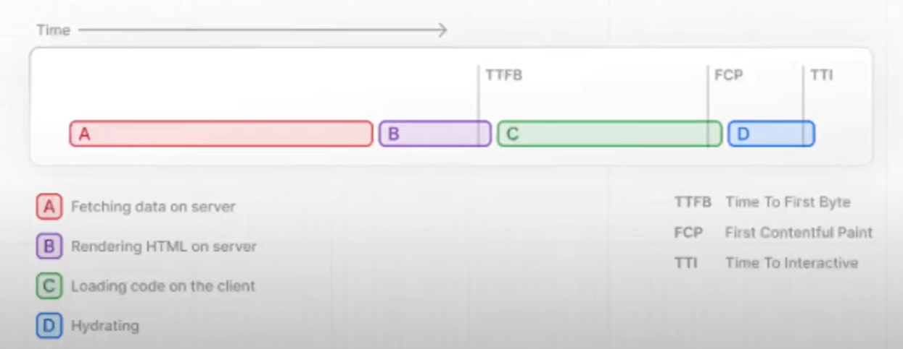

## Streaming with Suspense

-> SSR이 가지고 있는 한계점을 Streaming으로 해결할 수 있음

### SSR(Dynamic Rendering) 과정 & 한계

SSR(Dynamic Rendering) - 매 요청시 응답이 바뀐다.<br/>
공식문서 SSR 다이어그램


A. Fetching data on server <br/>
B. Rendering HTML on server - render 할 HTML을 서버에서 가져온다.<br/>
C. Loading code on the client<br/>
D. Hydrating - JavaScript를 통해 hydrating 시킴<br/>

### Streaming 해결책

=> SSR의 모든 동작이 sequantial(순차적으로) 진행되기 때문에 한계점이 발생함<br/>
서버에서 받을 필요가 없는(fetching data가 필요없는) HTML은 순차적으로 진행하기 때문에 대기해야 하는 문제 발생 ex) layout

-> 병렬적으로 이루어지게 변경되어야 함 - Streaming<br/>
-> 병렬적으로 가기 위해선 fetching이 필요한 컴포넌트와 필요없는 컴포넌트를 구분시켜 줘야함 - Suspense<br/>

```
<Suspense>
  <fetching data component />
</Suspense>
```

==> Streaming과 Suspense가 같이 사용되는 이유

### PPR(Partial Pre Rendering)과 차이점

PPR도 Streaming과 마찬가지로 병렬적으로 HTML을 렌더링하지만 ppr은 정적 콘텐츠와 동적 콘텐츠를 하나의 HTTP 요청으로 결합해 서버에서 한 번에 응답한다.<br/>
페이지를 렌더링할 때 여러 번의 네트워크 요청을 보내지 않고, 정적 콘텐츠와 동적 콘텐츠를 한 번에 받을 수 있다.

- 영향: 네트워크 왕복 횟수를 줄일 수 있어 페이지 로딩 속도가 개선된다. 동적 콘텐츠는 정적 콘텐츠와 함께 렌더링되지만, 별도의 요청 없이 동시에 처리된다.

- 주요 차이점
  - <strong>HTTP 요청</strong>: PPR은 하나의 요청으로 결합해 서버에서 한 번에 전달한다. 반면, 스트리밍은 콘텐츠가 준비되는 대로 여러 번에 걸쳐 데이터를 전송한다.
  - <strong>콘텐츠 전달 방식</strong>: PPR은 전체 콘텐츠가 준비될 때까지 한 번에 전달하지만, 스트리밍은 콘텐츠를 점진적으로 전달해 클라이언트가 부분적으로 렌더링하게 한다.
  - <strong>사용자 경험</strong>: PPR은 네트워크 요청 수를 줄여 초기 로딩 시간을 개선하지만, 스트리밍은 점진적으로 제공해 페이지가 완전히 로드되지 않아도 사용자가 일부 콘텐츠를 먼저 볼 수 있도록 한다.
